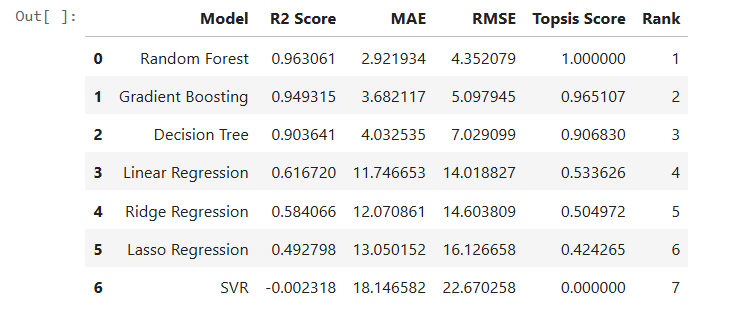
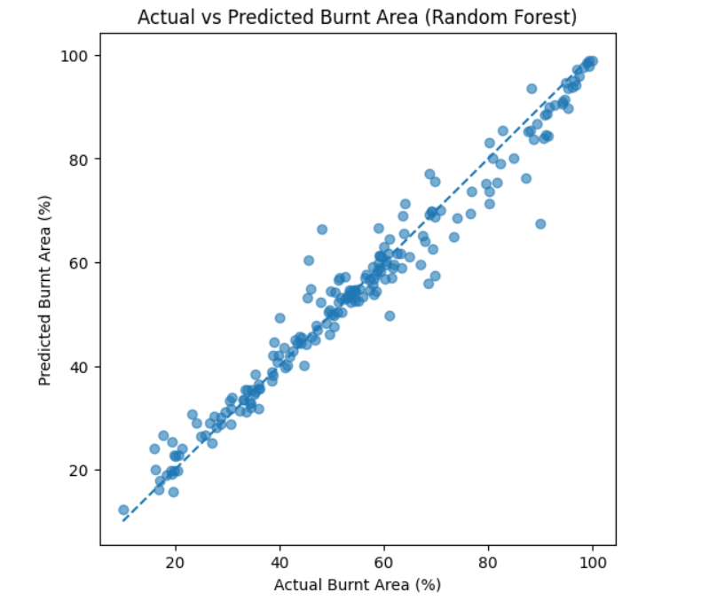

# Forest Fire Spread Simulation and Burnt Area Prediction using Machine Learning

## Abstract
This project implements an end-to-end pipeline combining modelling and simulation with machine learning.
A cellular automata–based forest fire simulator is used to generate synthetic data under varying environmental
conditions. Multiple regression models are trained to predict burnt area percentage. Model selection is
performed using conventional evaluation metrics as well as a multi-criteria decision-making technique (TOPSIS).
Both approaches consistently identify Random Forest as the most robust model.

---

## Problem Statement
Real-world forest fire datasets are often scarce, noisy, or incomplete. To overcome this limitation, a
simulation-driven data generation approach is adopted. The objective is to model forest fire spread dynamics
and use the generated synthetic data to train machine learning models capable of predicting fire impact.

---

## Methodology

### Forest Fire Simulation Model
The forest is represented as a two-dimensional cellular automata grid. Each cell corresponds to a discrete
forest region and can exist in one of the following states:
- Tree (1): Unburnt vegetation
- Fire (2): Actively burning vegetation
- Burnt/Empty (0): Burnt region

Fire spreads to neighbouring cells (von Neumann neighbourhood) based on a probabilistic rule. Burning cells
transition to the burnt state in the next timestep. This model captures spatial dependency, stochasticity,
and non-linear fire dynamics.

### Simulation Parameters

| Parameter | Description | Range |
|---------|-------------|-------|
| Grid Size | Forest grid dimension | 30 – 80 |
| Tree Density | Probability of tree presence | 0.4 – 0.9 |
| Initial Fire Probability | Probability of ignition | 0.001 – 0.05 |
| Spread Probability | Fire propagation probability | 0.1 – 0.9 |

### Output Variables
- Burnt Area Percentage
- Fire Duration (number of timesteps)

---

## Dataset Generation
A total of 1000 simulations were executed by randomly sampling parameters within predefined bounds. The
resulting dataset was stored in CSV format and used for machine learning.

Dataset location:
```
data/forest_fire_simulation_data.csv
```

---

## Machine Learning Models
The following regression models were trained and evaluated:
- Linear Regression
- Ridge Regression
- Lasso Regression
- Decision Tree Regressor
- Random Forest Regressor
- Gradient Boosting Regressor
- Support Vector Regressor (SVR)

---

## Evaluation Metrics
Model performance was evaluated using:
- R² Score
- Mean Absolute Error (MAE)
- Root Mean Squared Error (RMSE)

---

## Results

### Result Table (Model Comparison)
The table below summarises the performance of different machine learning models. 




---

### Result Graph

#### Actual vs Predicted Burnt Area
```markdown

```

---

## Model Selection using TOPSIS
To objectively select the optimal model, the Technique for Order Preference by Similarity to Ideal Solution
(TOPSIS) was applied. A custom command-line Python package (**Topsis-Prigya-102313061**) developed by the
author was used.

Criteria considered:
- R² Score (benefit criterion)
- MAE and RMSE (cost criteria)

Weights of 0.4, 0.3, and 0.3 were assigned to R², MAE, and RMSE respectively.

### TOPSIS Outcome
Both conventional metric-based evaluation and TOPSIS-based multi-criteria analysis ranked the
**Random Forest Regressor** as the best-performing model, indicating robustness and consistency in model
selection.

---

## Key Observations
- Forest fire dynamics are highly non-linear and stochastic
- Linear models fail to capture complex relationships
- Ensemble models outperform individual learners
- Random Forest provides the best balance between accuracy and error minimisation
- TOPSIS validates the robustness of the selected model

---

## Final Conclusion
The project demonstrates a complete pipeline integrating simulation-based data generation, machine
learning, and multi-criteria decision-making. Random Forest emerged as the optimal model both with and
without TOPSIS, confirming its reliability for predicting burnt area percentage in simulated forest fire
scenarios.

---

## Technologies Used
- Python
- NumPy
- Pandas
- Matplotlib
- Scikit-learn
- Google Colab
- Custom TOPSIS PyPI Package

---

## How to Run
1. Open `forest_fire_simulation_final.ipynb` in Google Colab
2. Run all cells sequentially from top to bottom
3. Results, graphs, and TOPSIS ranking will be generated automatically

---

## Repository Structure
```markdown
forest_fire_simulation/
├── forest_fire_simulation_final.ipynb
├── README.md
├── data/
│   └── forest_fire_simulation_data.csv
└── images/
    └── graph.png
```

---

## Author 
#### Prigya Goyal